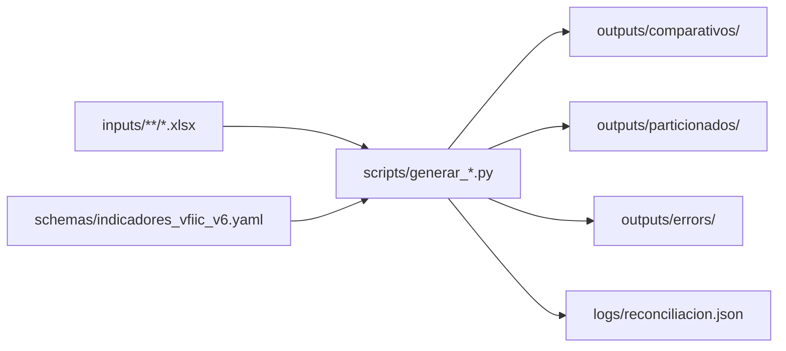

# Documentación VFIIC KPIs

Índice de guías del proyecto. El **comparativo apilado** es el reporte principal para seguimiento ejecutivo; el **particionado** ofrece la misma captura organizada por mes en un Excel por formulario.

## Vista general

## Guías por audiencia

| Guía | Audiencia | Contenido |
|------|-----------|-----------|
| [guia-instalacion.md](guia-instalacion.md) | Operador | Python, entorno virtual, `pip install -e .` |
| [guia-operativa.md](guia-operativa.md) | Operador | Corrida mensual, carpetas, scripts, mensajes en consola |
| [errores-y-validacion.md](errores-y-validacion.md) | Operador / desarrollador | Incidencias de captura, severidad, reportes detallado y crítico |
| [guia-indicadores-yaml.md](guia-indicadores-yaml.md) | Coordinador YAML | Formularios, columnas e indicadores en el schema |
| [arquitectura.md](arquitectura.md) | Desarrollador | Módulos, flujo de datos, comparativo, particionado |
| [TODO.md](TODO.md) | Desarrollador | Pendientes y convenciones locales |

## Comandos del operador

| Script | Salida |
|--------|--------|
| `python scripts/generar_comparativo.py` | `outputs/comparativos/comparativo_kpis_<timestamp>.xlsx` |
| `python scripts/generar_particionado.py` | `outputs/particionados/*.xlsx` |
| `python scripts/limpiar_salidas.py` | Borra Excel en `outputs/` (incluye `errors/`) |

Véase también [scripts/README.md](../scripts/README.md).

## Salidas generadas

| Carpeta | Descripción |
|---------|-------------|
| `outputs/comparativos/` | Un workbook apilado con todos los formularios procesables |
| `outputs/particionados/` | Un workbook por formulario: hoja `original` + una hoja por mes (más reciente primero) |
| `outputs/errors/` | Hasta cuatro archivos por corrida: reporte detallado y crítico (`.md` + `.json`) |
| `logs/reconciliacion.json` | Bitácora estructurada YAML vs inputs |
