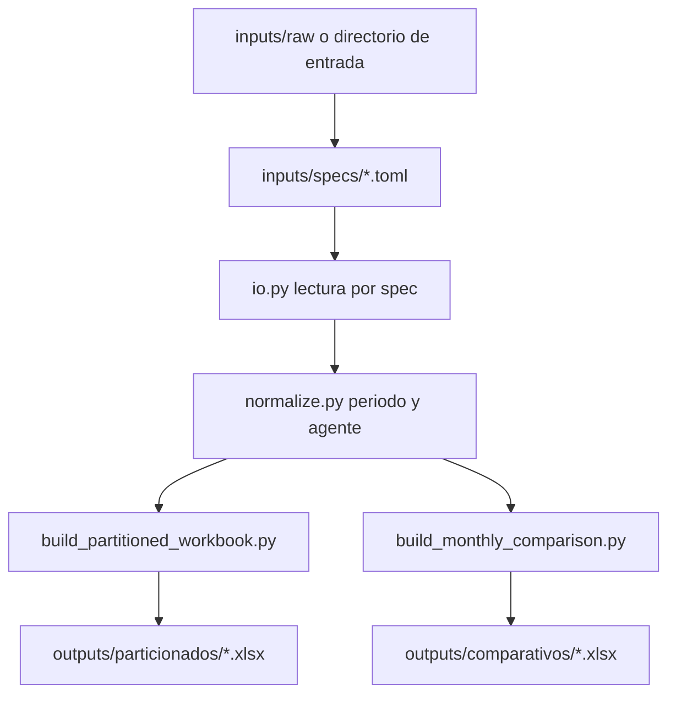
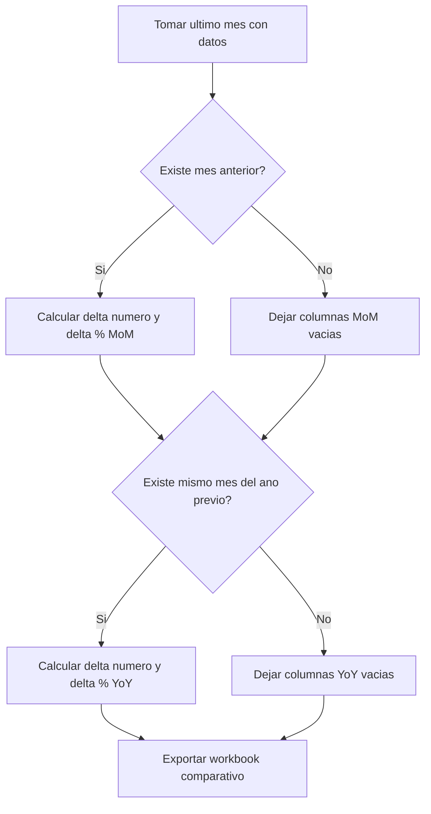

# Arquitectura del procesamiento de KPIs

## Objetivo

Procesar insumos heterogeneos por area y producir dos artefactos ejecutivos:
1. Workbook particionado por periodo mensual.
2. Workbook comparativo de variacion mensual y anual.

## Ejecucion recomendada

Comandos cortos desde la raiz del proyecto:

```bash
python scripts/build_partitioned_workbook.py
python scripts/build_monthly_comparison.py
```

Cada script acepta `--theme` con la ruta a un TOML de maquetación (por defecto `inputs/themes/excel_partitioned.toml` y `inputs/themes/excel_comparison.toml`). En una sola corrida, `run_all_reports.py` expone `--partitioned-theme` y `--comparison-theme`.

Alternativa en una sola corrida:

```bash
python scripts/run_all_reports.py
```

## Temas de presentación Excel

Los estilos (encabezado azul oscuro, tabla con bandas, formatos de porcentaje, anchos, filtros y congelado de paneles) viven en TOML versionables:

- `inputs/themes/excel_partitioned.toml` — hojas `original` y mensuales del particionado.
- `inputs/themes/excel_comparison.toml` — hoja `comparativo`.

El código los carga con `excel_theme.load_excel_theme` y los aplica tras `pandas.to_excel` mediante `excel_styling.apply_sheet_theme`, sin cambiar los nombres de columnas en los `DataFrame` de negocio.

## Flujo general



## Modulos principales

- `src/vfiic_kpis/spec_loader.py`
  - Carga los TOML y los transforma en objetos tipados (`AreaSpec`, `KpiSpec`).
- `src/vfiic_kpis/io.py`
  - Lee Excel por area en funcion de `source_glob`.
  - Compone `Agente/Titular` desde 1 o N columnas.
- `src/vfiic_kpis/normalize.py`
  - Estandariza periodo a datetime.
  - Deriva `periodo_mes_key` (`YYYY_mon`) y etiqueta de mes.
  - Crea llave de orden alfabetico normalizada (sin acentos, case-insensitive).
- `src/vfiic_kpis/metrics.py`
  - Calcula comparativo MoM y YoY por KPI.
  - Soporta parseo `numeric` y `sum_cantidad`.
- `src/vfiic_kpis/excel_export.py`
  - Escribe salidas en formato XLSX y dispara la maquetación por tema.
- `src/vfiic_kpis/excel_theme.py`
  - Parsea TOML de tema (colores, estilo de tabla, reglas de formato y etiquetas de encabezado).
- `src/vfiic_kpis/excel_styling.py`
  - Post-proceso openpyxl: etiquetas legibles, formatos numéricos, tabla de Excel, autofiltro y anchos.

## Contrato del spec TOML

```toml
[area]
id = "trabajo_social"
display_name = "Trabajo Social"
source_glob = "*.xlsx"
sheet_name = "Form responses"
date_column = "Periodo Evaluado"
agent_columns = ["Perito - Nombre(s)", "Perito - Apellido Paterno", "Perito - Apellido Materno"]
agent_output_column = "Agente/Titular"

[[kpis]]
name = "dictamenes_trabajo_social"
source_column = "Dictámenes Realizados"
aggregation = "sum"
value_parser = "numeric"
```

## Reglas de negocio implementadas

- Periodo de entrada: base esperada `YYYY-MM-DD`; se acepta datetime de Excel.
- Particionado mensual: por clave `YYYY_mon` en espanol abreviado (`ene`, `feb`, `mar`, ...).
- Orden de agentes: ascendente usando normalizacion de acentos y mayusculas.
- Comparativo:
  - Siempre intenta ultimo mes vs mes anterior.
  - Solo agrega YoY cuando existe mismo mes del ano previo.

## Diagrama de decision para comparativo



## Escalabilidad para 60+ areas

- Un spec por area evita hardcodear columnas en codigo.
- Los scripts reutilizan pipeline comun y solo cambian las especificaciones.
- Nuevos parseadores de KPI se agregan en `metrics.py` sin modificar los scripts CLI.

