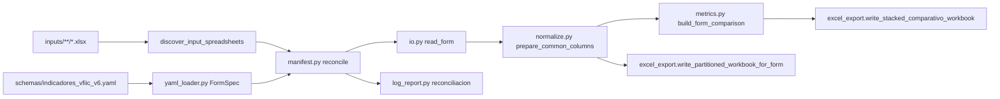
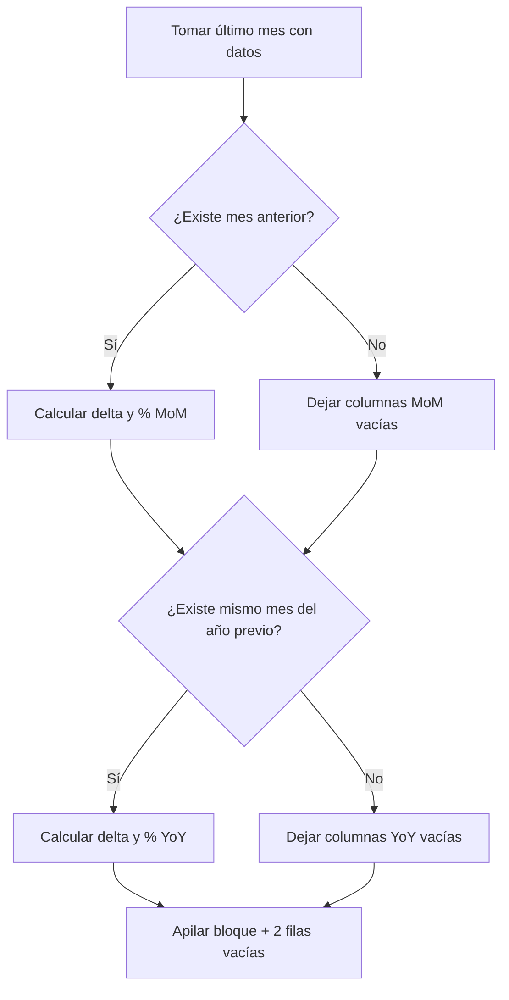

# Arquitectura del procesamiento de KPIs

## Objetivo

Procesar exportaciones de formularios Jotform (un `.xlsx` por formulario bajo `inputs/`, en cualquier subcarpeta) y producir, a partir de un único schema YAML como fuente de verdad, dos artefactos ejecutivos:

1. **Comparativo apilado**: un workbook con un solo sheet `Comparativo` donde cada formulario forma un bloque (título + encabezado + filas) separado del siguiente por dos filas vacías. Los anchos de columna se aplican al final, considerando todo el contenido.
2. **Particionado por mes**: un workbook por formulario con la hoja `original` y una hoja por cada `YYYY_mon` con datos.

Ambos artefactos respetan las reglas:

- El último mes con datos define las etiquetas dinámicas.
- MoM se llena cuando existe mes anterior.
- YoY se llena cuando existe el mismo mes del año previo.
- Las columnas se mantienen siempre visibles; las celdas vacías indican falta de historia.
- Múltiples registros del mismo mes se **suman** por KPI.

## Quién ejecuta qué

| Audiencia | Entrada | Código |
|-----------|---------|--------|
| Operadores | `python scripts/generar_*.py` | Scripts delgados en `scripts/` |
| Desarrollo | `lib/vfiic_kpis/` | Paquete Python `vfiic_kpis` (importado por los scripts) |

Los operadores **no** necesitan abrir `lib/`; los scripts en `scripts/` son el contrato de uso.

## Flujo general

## Descubrimiento de insumos

`discover_input_spreadsheets(input_dir)` en `manifest.py`:

- Recorre `input_dir` de forma **recursiva** (`rglob("*.xlsx")`).
- Ignora archivos temporales de Excel (`~$*.xlsx`).
- No lee comprimidos (`.zip`, `.7z`, etc.); véase [TODO.md](TODO.md) para uso dev-only.
- Agrupa por **basename exacto**; si el mismo nombre aparece en rutas distintas, marca el grupo como duplicado y excluye esos archivos del matching.
- Construye índices por nombre plegado (`fold`) y por nombre canónico (prefijo `AREA - ` opcional).

## Módulos principales

- `lib/vfiic_kpis/yaml_loader.py`
  - Carga el YAML y devuelve `list[FormSpec]`. Cada formulario es un mapeo con `ingesta` y `kpis`.
  - Deriva `area_id` por slug de `display_name` (override con `ingesta.id`).
- `lib/vfiic_kpis/manifest.py`
  - Reconcilia los `FormSpec` con `inputs/` (recursivo).
  - Resuelve archivos por nombre del YAML, con o sin prefijo `AREA - ` en disco, y equivalencia tras `fold` (sin acentos, casefold). Si varias variantes del mismo formulario coexisten, marca ambigüedad. Si el mismo basename está en varias carpetas, marca duplicado.
  - Resuelve hoja, columna de fecha (alias) y columnas de persona/KPI con `text_match.find_matching_column`.
- `lib/vfiic_kpis/log_report.py`
  - Imprime el resumen humano y persiste un JSON sidecar con el detalle de cada formulario.
- `lib/vfiic_kpis/user_messages.py`
  - Único módulo con cadenas en español para consola, reconciliación y errores frecuentes (archivo abierto, YAML inválido, etc.).
- `lib/vfiic_kpis/io.py`
  - Lee un formulario ya resuelto. Compone `Agente/Titular` desde una o varias columnas, agrega `source_file`, `area_id`, `area_nombre` y delega normalización temporal a `prepare_common_columns`.
- `lib/vfiic_kpis/normalize.py`
  - Convierte `periodo` a `datetime`, calcula `periodo_mes_key`, `periodo_mes_label` y la llave de orden alfabético sin acentos.
- `lib/vfiic_kpis/metrics.py`
  - `build_form_comparison(df, resolution)` produce un `FormComparisonResult` con una fila por KPI: `valor_actual`, `valor_mes_anterior`, `valor_anio_anterior`, `diferencia_mom`, `porcentaje_mom`, `tendencia_mom`, `diferencia_yoy`, `porcentaje_yoy`, `tendencia_yoy`, junto con etiquetas legibles del mes actual, mes anterior y mismo mes año anterior.
  - La tendencia siempre asume `subir es bueno`.
- `lib/vfiic_kpis/excel_export.py`
  - `write_partitioned_workbook_for_form` (un workbook por formulario).
  - `write_stacked_comparativo_workbook` (un workbook con un sheet apilado); las columnas derivadas de diferencia y % se emiten como fórmulas Excel. Decide globalmente si incluir las columnas YoY a partir de los resultados (`_resolve_stacked_columns`).
- `lib/vfiic_kpis/excel_styling.py`
  - Helpers reutilizables para pintar título, encabezado, formatos numéricos, rayas de fila, bold de porcentajes y formato condicional de color semántico (`apply_semantic_conditional_format`) en bloques con offset arbitrario.
- `lib/vfiic_kpis/excel_theme.py`
  - Carga TOML de tema (colores, formatos, etiquetas de encabezado).
- `lib/vfiic_kpis/text_match.py`
  - `fold`, `slugify`, `find_matching_column`, `canonical_input_basename` y `build_input_file_index` para tolerar variaciones de mayúsculas y acentos en nombres de archivos y columnas, y prefijos `AREA - ` / `PERSONA - ` en insumos (véase [TODO.md](TODO.md) para el alcance operativo actual).

## Decisiones del comparativo

En el Excel generado, las columnas de **diferencia y variación** (D, E, G y H en cada bloque: MoM y YoY) se escriben como **fórmulas** que referencian los valores base (mes actual, mes anterior, mismo mes año anterior). Así, quien edite o complete a mano esas celdas base en Excel verá actualizarse los cálculos sin `#DIV/0!` ni `#VALUE!` cuando falten datos o el denominador sea cero.

El **color de fuente** en diferencias y porcentajes se aplica como **formato condicional Excel** mediante `apply_semantic_conditional_format`, con tres reglas por rango: `> 0` → azul (positivo), `< 0` → rojo (negativo), `= 0` → negro (neutro). Como Excel reevalúa las reglas al recalcular fórmulas, el color se actualiza automáticamente cuando el usuario edita los valores base. El bold de los porcentajes se aplica como estilo base (`paint_porcentaje_bold`) y sobrevive a la evaluación condicional, ya que las reglas sólo sobrescriben `font.color`.

Las **tres columnas YoY** (`Mismo mes año anterior`, `Diferencia (año anterior)` y `Variación % (año anterior)`) se omiten globalmente cuando ningún formulario alcanza 13 meses de historia, es decir, cuando ningún resultado tiene `valor_anio_anterior` no nulo. La decisión es "global any": basta con que un formulario tenga la columna llena para que las tres columnas YoY aparezcan en todos los bloques (los que carezcan de historia mostrarán celdas vacías). Esto se resuelve en `_resolve_stacked_columns` antes de escribir cualquier bloque, de modo que todos los bloques comparten la misma cabecera del sheet.

## Reconciliación schema vs inputs

El reporte de reconciliación se imprime al final de cada corrida y se persiste en `logs/reconciliacion.json` con estas categorías:

- `procesables`: formulario con `ingesta` completa y archivo, al menos un KPI mapea.
- `sin_archivo`: formulario con `ingesta` pero sin archivo usable bajo `inputs/`.
- `config_incompleta`: falta `archivo`, fechas o columnas de persona en el YAML.
- `problemas_columnas`: archivo localizado pero columna de fecha o KPIs no coinciden; varios archivos resuelven al mismo formulario; o el formulario apunta a un nombre duplicado.
- `archivos_duplicados`: mismo basename en rutas distintas bajo `inputs/` (ninguna copia se procesa hasta resolver el conflicto).
- `archivos_sin_schema`: `.xlsx` en `inputs/` que no aparecen en el YAML.

Las rutas en consola y JSON se expresan relativas a `inputs/` cuando es posible.

## Temas de presentación

- `themes/excel_partitioned.toml`: hoja `original` y mensuales del particionado.
- `themes/excel_comparison.toml`: bloques del comparativo apilado, con etiquetas parentéticas (`Diferencia (mes anterior)`, `Variación % (año anterior)`, etc.) y formatos numéricos por columna.

## Escalabilidad

- Para sumar un nuevo formulario al pipeline basta con agregar un bloque con `ingesta` y `kpis` en el YAML y copiar el Excel a `inputs/` (o a una subcarpeta con nombre de archivo único).
- Cualquier columna nueva se reportará si está en el archivo, o aparecerá como "sin columna" en la bitácora si falta.

## Notas para desarrolladores

Pendientes de producto y convenciones locales (escenarios demo comprimidos, flujo AREA vs PERSONA): [TODO.md](TODO.md).
