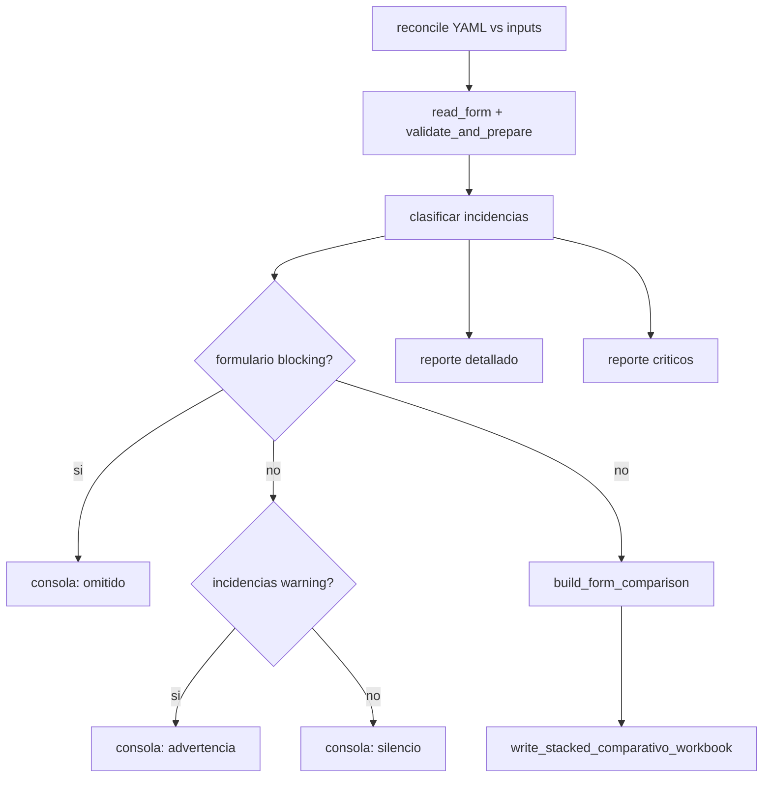

# Errores y validación de captura

Esta guía describe cómo el pipeline clasifica incidencias, qué ver en consola y qué reportes abrir. El comparativo solo necesita **periodo evaluado** y **valores de KPI** definidos en el YAML; el nombre del agente es deseable para el particionado pero no bloquea el comparativo.

## Mensajes en consola

Durante `python scripts/generar_comparativo.py` puede ver tres comportamientos por formulario:

| Mensaje | Significado | El formulario entra al comparativo |
|---------|-------------|-----------------------------------|
| `[comparativo] omitido '…': …` | Incidencia **breaking**: ninguna fila utilizable o fallo de pipeline | No |
| `[comparativo] advertencia '…': …` | El comparativo se genera, pero hay filas que afectan la confiabilidad (p. ej. periodo futuro) | Sí |
| *(sin mensaje)* | Sin incidencias breaking ni de advertencia en consola (puede haber detalle en el reporte) | Sí |

Ejemplos de motivos **omitido**:

- `sin periodos parseables` — ninguna fila pasó la validación.
- `sin filas calculables` — hay filas válidas pero no alcanzan para calcular el comparativo.
- Mensaje de error al leer el archivo (permisos, formato, etc.).

Ejemplos de **advertencia**:

- `2 filas con periodo futuro; ver reporte de errores`

Las incidencias **informativas** (agente faltante en filas que sí aportan KPIs, filas vacías al final de la hoja) no se imprimen en consola; aparecen solo en el reporte detallado.

## Severidad de incidencias

| Nivel | Cuándo | Consola | Reporte detallado | Reporte crítico |
|-------|--------|---------|-------------------|-----------------|
| **Breaking** | Impide incluir el formulario en el comparativo | `omitido` | Sí | Sí |
| **Advertencia** | El comparativo se genera pero la información puede ser poco confiable | `advertencia` | Sí | No |
| **Informativo** | No afecta la generación del comparativo | Silencio | Sí | No |

## Flujo de validación



## Validación de filas

Reglas aplicadas en `lib/vfiic_kpis/row_validation.py` tras leer cada Excel:

| Situación | ¿Entra la fila? | Severidad | Notas |
|-----------|-----------------|-----------|-------|
| Periodo válido + al menos un KPI con dato | Sí | Informativo si falta agente | El comparativo agrega por mes, no por agente |
| Periodo válido sin agente ni KPIs | No | Informativo (`agente_faltante`) | No aporta datos al comparativo |
| Periodo faltante o inválido (con otros datos en la fila) | No | Breaking | |
| Periodo futuro respecto a la fecha de corrida | No | Advertencia | Si es la única fila útil, el formulario queda omitido |
| Filas completamente vacías al final de la hoja | No | Informativo | Se agrupan por rango de renglones |

## Reconciliación YAML vs inputs

Antes de leer filas, `manifest.py` resuelve archivo, hoja, columna de fecha y columnas de KPI.

### Motivos que bloquean el comparativo

| Código interno | Mensaje al operador |
|----------------|---------------------|
| `file_not_found_in_inputs` | archivo no encontrado en inputs |
| `incomplete_yaml_config` | configuración incompleta en el YAML |
| `date_column_mismatch` | ninguna columna de fecha del YAML coincidió con el archivo |
| `kpi_column_mismatch` | ningún KPI del YAML coincidió con columnas del archivo |
| `ambiguous_input_file` | varios archivos en inputs coinciden con el mismo formulario |
| `duplicate_input_file` | varios archivos con el mismo nombre en distintas carpetas |
| `header_read_failed` | fallo al leer encabezados del Excel |

### Motivos que no bloquean (solo informativos en reconciliación)

| Código interno | Comportamiento |
|----------------|----------------|
| `person_column_mismatch` | El formulario **sí se procesa** si hay columna de fecha y al menos un KPI; la columna de agente queda vacía |

Los archivos en `inputs/` sin entrada en el YAML (`archivos_sin_schema`) se listan en el reporte detallado y en `logs/reconciliacion.json`, pero no impiden generar el comparativo de los demás formularios.

## Códigos de incidencia por fila

| Código | Severidad | Mensaje al operador |
|--------|-----------|---------------------|
| `fecha_faltante` | Breaking | Falta el periodo evaluado — complete la columna de fecha o elimine la fila. |
| `fecha_invalida` | Breaking | Periodo evaluado no reconocido — use un formato de fecha válido. |
| `sin_filas_validas` | Breaking | Ninguna fila válida — revise periodo, agente y datos de captura. |
| `sin_periodos_calculables` | Breaking | No hay periodos suficientes para calcular el comparativo. |
| `periodo_futuro` | Advertencia | Periodo futuro — la fila no se incluye hasta que corresponda el mes evaluado. |
| `agente_faltante` | Informativo | Periodo sin agente — complete nombre y apellidos, o elimine la fila. |
| `filas_vacias` | Informativo | Filas vacías — elimine el rango formateado sin datos al final de la hoja. |

## Reportes en `outputs/errors/`

Cada corrida con incidencias escribe hasta **cuatro archivos** con el mismo timestamp (tomado de la carpeta de captura bajo `inputs/` cuando existe):

| Archivo | Contenido |
|---------|-----------|
| `errores_captura_<stamp>.md` | Todas las incidencias: reconciliación, filas, agente, filas vacías |
| `errores_captura_<stamp>.json` | Mismo detalle en JSON |
| `errores_captura_<stamp>_criticos.md` | Solo lo que **bloquea** formularios en el comparativo |
| `errores_captura_<stamp>_criticos.json` | Mismo subconjunto crítico en JSON |

**Cuándo usar cada uno:**

- Empiece por `*_criticos.md` para saber qué formularios faltan en el comparativo y por qué.
- Use el reporte detallado para corregir captura fila por fila (agente, filas vacías, periodos futuros en formularios que sí entraron).

Estructura JSON resumida:

```json
{
  "generado_en": "...",
  "input_dir": "inputs",
  "schema": "schemas/indicadores_vfiic_v6.yaml",
  "critico": false,
  "reconciliacion": {
    "sin_archivo": [],
    "config_incompleta": [],
    "problemas_columnas": [],
    "archivos_duplicados": [],
    "archivos_sin_schema": []
  },
  "formularios": [
    {
      "display_name": "...",
      "estado": "omitido | procesado_parcial | ok",
      "filas_validas": 0,
      "filas_omitidas": 0,
      "motivo_pipeline": null,
      "incidencias": []
    }
  ],
  "totales": {}
}
```

En el JSON crítico, `critico` es `true` y las listas solo incluyen entradas blocking.

## Referencia para desarrolladores

| Módulo | Responsabilidad |
|--------|-----------------|
| `lib/vfiic_kpis/row_validation.py` | Validación fila a fila; emite `RowIssue` |
| `lib/vfiic_kpis/issue_severity.py` | Mapa breaking / warning / info; helpers de filtrado |
| `lib/vfiic_kpis/capture_errors.py` | Ensambla y escribe reportes `.md` / `.json` |
| `lib/vfiic_kpis/cli.py` | `_read_form_with_summary` (consola); `_emit_comparativo` (pipeline) |
| `lib/vfiic_kpis/paths.py` | `errors_report_paths()` — cuatro rutas timestamped |

Véase también [arquitectura.md](arquitectura.md) para el flujo completo del pipeline.
