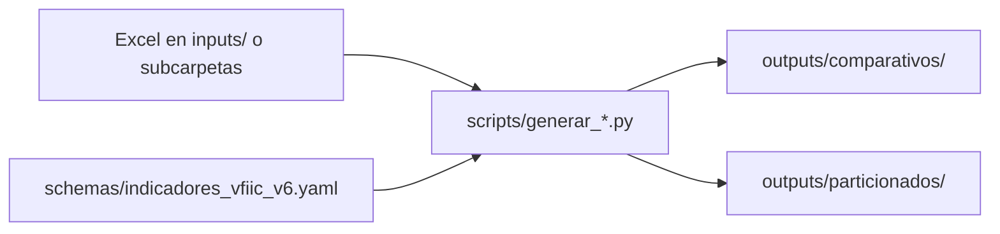

# Guía operativa

Flujo habitual para generar reportes KPI a partir de exportaciones Excel (Jotform / Google Sheets).

## Carpetas que usa el operativo

| Carpeta | Uso |
|---------|-----|
| `inputs/` | Copie aquí los `.xlsx` exportados (un archivo por formulario). Puede usar subcarpetas para organizarlos (p. ej. por área o mes). El YAML solo guarda el **nombre** del archivo, no la ruta. |
| `schemas/indicadores_vfiic_v6.yaml` | Catálogo de formularios, columnas e indicadores. |
| `outputs/comparativos/` | Reporte comparativo apilado (`comparativo_kpis.xlsx`). |
| `outputs/particionados/` | Un Excel por formulario con hojas por mes. |
| `logs/` | Bitácora de reconciliación (`reconciliacion.json`). |
| `scripts/` | **Únicos comandos** que debe ejecutar para generar o limpiar salidas. |

## Pasos mensuales

1. Copie los archivos `.xlsx` nuevos o actualizados en `inputs/` o en una subcarpeta dentro de `inputs/`. El nombre del archivo debe coincidir con `ingesta.archivo` del YAML (puede anteponer `AREA - ` si así lo entrega su área).
2. **No deje dos archivos con el mismo nombre** en carpetas distintas (p. ej. `inputs/enero/demo.xlsx` y `inputs/febrero/demo.xlsx`). El sistema los detecta como duplicado y no los procesa hasta que deje solo uno.
3. Si su jefe cambió indicadores o columnas, edite el schema y/o el Excel (véase [guia-indicadores-yaml.md](guia-indicadores-yaml.md)).
4. Active el entorno virtual (véase [guia-instalacion.md](guia-instalacion.md)).
5. Ejecute uno de estos comandos **desde la raíz del proyecto**:

```bash
# Comparativo + particionados (recomendado)
python scripts/generar_todos_los_reportes.py

# Solo comparativo
python scripts/generar_comparativo.py

# Solo particionados
python scripts/generar_particionado.py
```

6. Revise el resumen en pantalla y, si hubo incidencias, el detalle en `logs/reconciliacion.json`.
7. Abra los Excel en `outputs/comparativos/` y `outputs/particionados/`.

Para vaciar solo los Excel generados (sin borrar `logs/`):

```bash
python scripts/limpiar_salidas.py
```

## Reconciliación

Al final de cada corrida verá un resumen que clasifica formularios y archivos:

- **Procesables**: listos para el reporte.
- **Sin archivo en inputs**: el YAML referencia un Excel que no se encontró bajo `inputs/`.
- **Configuración incompleta en el YAML**: falta `archivo`, fechas o columnas de persona en `ingesta`.
- **Problemas de columnas**: el Excel existe pero no coinciden fecha, persona o KPIs; o varios `.xlsx` resuelven al mismo formulario.
- **Archivos con nombre duplicado**: el mismo nombre de archivo aparece en más de una ruta bajo `inputs/`.
- **Archivos en inputs sin entrada en el YAML**: `.xlsx` huérfanos.

## Problemas frecuentes

| Síntoma | Qué hacer |
|---------|-----------|
| Mensaje de archivo abierto en Excel | Cierre el `.xlsx` en Excel (insumo o reporte generado) y vuelva a ejecutar el script. |
| Formulario sin archivo | Verifique el nombre en `ingesta.archivo` y que el `.xlsx` esté en `inputs/` o en una subcarpeta. El resumen indica la ruta relativa cuando aplica. |
| Nombre duplicado en inputs | Deje una sola copia del archivo o renombre uno de los duplicados para que cada nombre sea único en todo `inputs/`. |
| KPI sin columna | Ajuste `columna_origen` en el YAML o el encabezado en el Excel exportado. |
| Error al leer el YAML | Revise indentación y sintaxis; véase [guia-indicadores-yaml.md](guia-indicadores-yaml.md). |

## Flujo resumido


