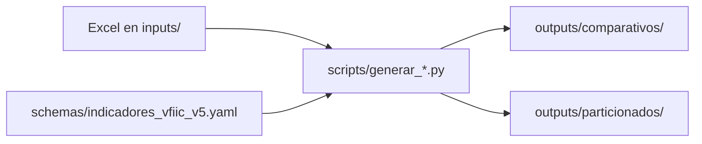

# Guía operativa

Flujo habitual para generar reportes KPI a partir de exportaciones Excel (Jotform / Google Sheets).

## Carpetas que usa el operativo

| Carpeta | Uso |
|---------|-----|
| `inputs/` | Copie aquí los `.xlsx` exportados (un archivo por formulario). El nombre puede ir sin prefijo, o con `AREA - ` o `PERSONA - ` delante del nombre definido en el YAML (use solo una modalidad por corrida). |
| `schemas/indicadores_vfiic_v5.yaml` | Catálogo de formularios, columnas e indicadores. |
| `outputs/comparativos/` | Reporte comparativo apilado (`comparativo_kpis.xlsx`). |
| `outputs/particionados/` | Un Excel por formulario con hojas por mes. |
| `logs/` | Bitácora de reconciliación (`reconciliacion.json`). |
| `scripts/` | Comandos para generar o limpiar salidas. |

## Pasos mensuales

1. Copie los archivos `.xlsx` nuevos o actualizados en `inputs/` (p. ej. `AREA - VFIIC KPIs ....xlsx` o el mismo nombre sin prefijo que en `ingesta.archivo`).
2. Si su jefe cambió indicadores o columnas, edite el schema y/o el Excel (véase [guia-indicadores-yaml.md](guia-indicadores-yaml.md)).
3. Active el entorno virtual (véase [guia-instalacion.md](guia-instalacion.md)).
4. Ejecute uno de estos comandos desde la raíz del proyecto:

```bash
# Comparativo + particionados (recomendado)
python scripts/generar_todos_los_reportes.py

# Solo comparativo
python scripts/generar_comparativo.py

# Solo particionados
python scripts/generar_particionado.py
```

5. Revise el resumen en pantalla y, si hubo incidencias, el detalle en `logs/reconciliacion.json`.
6. Abra los Excel en `outputs/comparativos/` y `outputs/particionados/`.

Para vaciar solo los Excel generados (sin borrar `logs/`):

```bash
python scripts/limpiar_salidas.py
```

## Reconciliación

Al final de cada corrida verá un resumen que clasifica formularios y archivos:

- **Procesables**: listos para el reporte.
- **Sin archivo en inputs**: el YAML referencia un Excel que no está en `inputs/`.
- **Configuración incompleta en el YAML**: falta `archivo`, fechas o columnas de persona en `ingesta`.
- **Problemas de columnas**: el Excel existe pero no coinciden fecha, persona o KPIs; o hay varios `.xlsx` para el mismo formulario (p. ej. con y sin prefijo `AREA - `).
- **Archivos en inputs sin entrada en el YAML**: `.xlsx` huérfanos.

## Problemas frecuentes

| Síntoma | Qué hacer |
|---------|-----------|
| Mensaje de archivo abierto en Excel | Cierre el `.xlsx` en Excel (insumo o reporte generado) y vuelva a ejecutar el script. |
| Formulario sin archivo | Verifique el nombre en `ingesta.archivo` (sin prefijo) y que el archivo esté en `inputs/`, con o sin `AREA - ` / `PERSONA - `. |
| KPI sin columna | Ajuste `columna_origen` en el YAML o el encabezado en el Excel exportado. |
| Error al leer el YAML | Revise indentación y sintaxis; véase [guia-indicadores-yaml.md](guia-indicadores-yaml.md). |

## Flujo resumido



